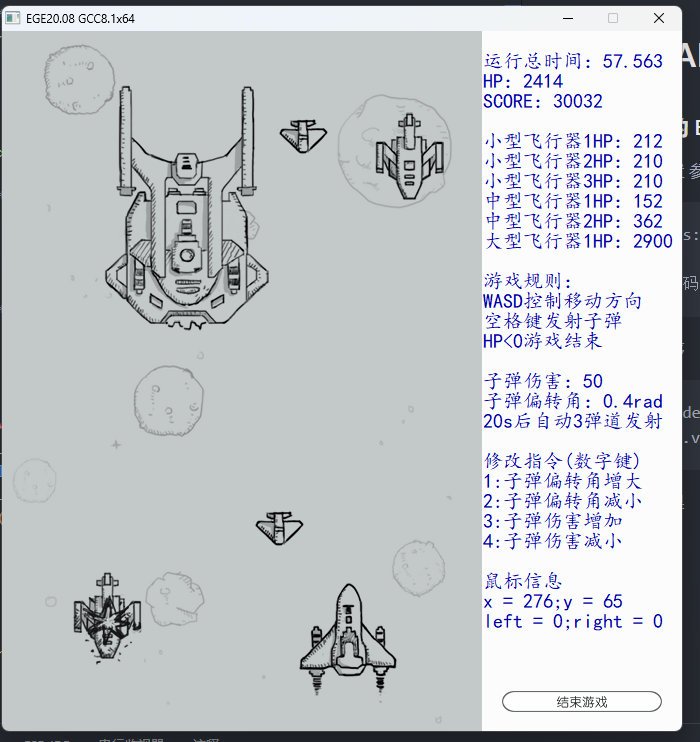
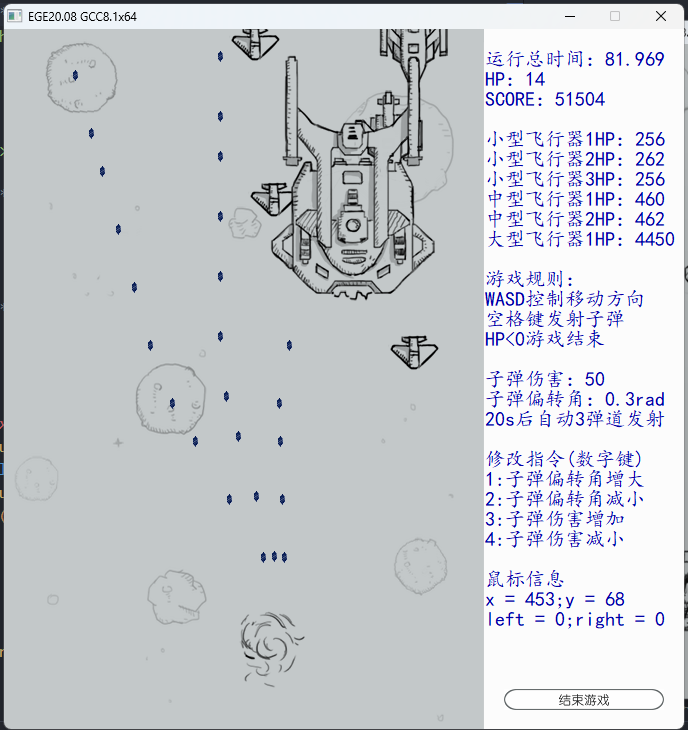

# AIRPLANE_WAR (飞机大战)
### 使用C++的 EGE图形库 制作
0. 环境配置 
   参考此链接完成环境配置
    
        https://blog.csdn.net/qq_39151563/article/details/100161986
    
        将编码改为GBK

1. 运行程序
   
        VSCode 
        按照.vscode/launch.json与.vscode/tasks.json中的配置运行
2. 运行效果
   

